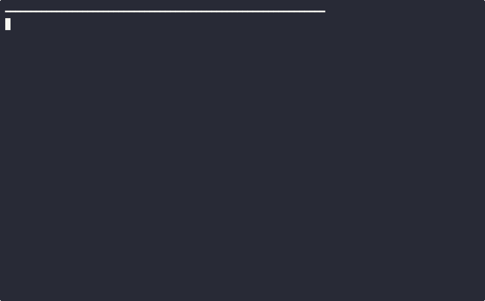

# pi-import-claude-history

<p align="center">
  
</p>

Import **Claude Code** session logs (NDJSON / `.jsonl`) into **[Pi](https://github.com/mariozechner/pi-coding-agent)** so you can continue the same thread inside Pi’s agent UI.

This repo publishes a single Pi extension: **`claude-import.ts`**, which registers the slash command **`/import-claude`**.

## Features

- **`/import-claude`** — reads a Claude session from disk and writes a new Pi session file under `~/.pi/agent/sessions/...`.
- **Autocomplete** — when you type the command, Pi can suggest Claude session IDs discovered under `~/.claude/projects/**/*.jsonl`.
- **Modes** — `compact` (default, readable) vs `strict` (includes tool_use / tool_result as text).
- **Turn limit** — import only the last *N* turns to keep context bounded.

## Requirements

- [Pi coding agent](https://github.com/mariozechner/pi-coding-agent) with extension support.
- Claude Code stores sessions under `~/.claude/projects/<encoded-path>/<session-id>.jsonl`.

## Install

Copy (or symlink) the extension into Pi’s extensions directory:

```bash
cp src/claude-import.ts ~/.pi/agent/extensions/
# optional: project-local instead
# mkdir -p .pi/extensions && cp src/claude-import.ts .pi/extensions/
```

In Pi, reload extensions:

```text
/reload
```

## Usage

```text
/import-claude <session-id|path.jsonl> [--mode compact|strict] [--turns N]
```

| Argument | Meaning |
|----------|---------|
| `session-id` | Looks up `~/.claude/projects/*/<session-id>.jsonl`. |
| `path.jsonl` | Absolute or relative path to a Claude `.jsonl` file. |
| `--mode compact` | Default: user + assistant **text** turns; collapses noisy repeats. |
| `--mode strict` | Also surfaces **tool_use** / **tool_result** lines as assistant text. |
| `--turns N` | Keep only the last **N** turns (default `60`, max `400`). |

After import, Pi writes a new JSONL session file and notifies you. Open the **session picker** in Pi and load that session to continue.

### Try with the bundled sample

```bash
# From repo root; in Pi, cwd should be this repo (or use absolute path):
/import-claude examples/sample-claude-session.jsonl
```

See `examples/sample-claude-session.jsonl` for the minimal Claude NDJSON shape this importer expects.

## Where files go

Imported Pi sessions are written to:

```text
~/.pi/agent/sessions/--<cwd-encoded>--/<iso-timestamp>_<pi-session-id>.jsonl
```

The first assistant message is a **bootstrap** summary (source path, mode, turn counts, tool counts, objective snippet).

## Demo

A short terminal walkthrough is in **`demo/`** (recorded with [asciinema](https://asciinema.org/) + [agg](https://github.com/asciinema/agg) + `ffmpeg`):

- `demo/demo.mp4` — H.264 video (~11s), easy to upload or attach to a post.
- `demo/demo.gif` — same session as a GIF (embedded at the top of this README).

Regenerate locally (requires [`asciinema`](https://asciinema.org/) and [`agg`](https://github.com/asciinema/agg)):

```bash
./demo/record-demo.sh
```

## Project layout

```text
.
├── LICENSE
├── README.md
├── package.json          # metadata + peerDependency on @mariozechner/pi-coding-agent
├── src/
│   └── claude-import.ts  # Pi extension (default export)
├── examples/
│   └── sample-claude-session.jsonl
└── demo/
    ├── README.md
    ├── record-demo.sh
    ├── demo.cast         # optional; generated
    ├── demo.gif          # generated / committed for sharing
    └── demo.mp4          # generated / committed for sharing
```

## License

MIT — see [LICENSE](./LICENSE).
